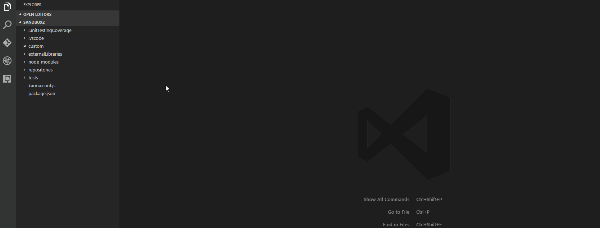

# netsuite-upload VS Code plugin

[](https://marketplace.visualstudio.com/items?itemName=tomastvrdy.netsuite-upload)

**netsuite-upload** is a Visual Studio Code extension that allows you to manage your SuiteScript files directly from the IDE & helps you with defining of new momdules & module dependecies

## Features

### 1. NetSuite File Cabinet Management

Right-click the file/folder in the navigation panel to see the options:

- `Pull file from NetSuite` - downloads file from NetSuite
- `Push file to NetSuite` - uploads file to NetSuite
- `Delete file in NetSuite` - deletes file in NetSuite
- `Compare file with NetSuite` - compares your local version with the NetSuite one
- `Pull folder from NetSuite` - Download the folder content from NetSuite



### 2. Snippets & commands

- `Snippets for module initialization` - type _defineRestlet..._, choose your module type and hit enter
- `Commands for adding new NetSuite/custom dependencies` - open command line (`Ctrl`-`Shift`-`P`) and type
  - _add netsuite dependency_ for choosing of the NetSuite built-in module from the list
  - _add custom dependency_ for defining od custom dependecies


## Setup

### NetSuite setup

- Upload `netSuiteRestlet/vscodeExtensionRestlet.js` file somewhere in the `SuiteScripts` folder in NetSuite
- Create a new Script record for this RESTlet.
- Create a new Script Deployment for this Script. Note the URL. The RESTlet URL will be set in `settings.json`.

** Future versions of this VS Code Extension may require that you upgrade the RESTlet file in NetSuite. Take note if the extension receives an update, and check back here.

### VSCode project setup

- Open your local root **SuiteScripts** folder in VSCode
- If not yet created, create one or update the project `settings.json` inside the `.vscode` folder
- Copy the following code to `settings.json` and update with your settings

### Authentication

NLAuth is supported. OAuth is attempted in the code, but I couldn't make it work locally. I could use some testers.

#### For regular NLAuth

Place the following in either Workspace settings or general User settings:

```javascript
{
  // Authentication header
  "netSuiteUpload.authentication": "NLAuth nlauth_account=<ACCOUNTID>, nlauth_email=<LOGIN>, nlauth_signature=<PASSWORD>, nlauth_role=<ROLE>",

}
```

- ACCOUNTID - Your NetSuite account ID number
- LOGIN - Your email address used to log into NetSuite
- PASSWORD - Your password
- ROLE - The NetSuite RoleID for which you have web service/API permissions.

#### OAuth

To experiment with OAuth, leave the setting for `netSuiteUpload.authentication` unset or commented out.

- If you wish to use OAuth authentication instead of basic authentication you can leave the authentication header blank and use the OAuth settings properties.
- First generate an Integration record in NetSuite, make sure the 'token based authentication' scheme is checked, and save the token and secret
- Second log into a role you wish to use for authentication and from the manage tokens center generate a new token and secret using the Integration from the previous step
- Input the 4 values from above in the corresponding settings options along with the account number in the realm property

### settings.json

```javascript
{
  // Authentication header for NLAuth
  "netSuiteUpload.authentication": "NLAuth nlauth_account=<ACCOUNTID>, nlauth_email=<LOGIN>, nlauth_signature=<PASSWORD>, nlauth_role=<ROLE>",

  // Script Deployment URL for the deployed vscodeExtensionRestlet.js
  "netSuiteUpload.restlet": "<RESTlet URL>",

  // Temporary folder (e.g. C:\\temp or /tmp) - used for storing compared files
  "netSuiteUpload.tempFolder": "<TEMP FOLDER PATH>"

  // If attempting OAuth, fill out these
  // Oauth NetSuite Key or Token ID
  "netSuiteUpload.netSuiteKey": "<NETSUITE TOKEN KEY>",
  // Oauth NetSuite Secret
  "netSuiteUpload.netSuiteSecret": "<NETSUITE SECRET>",
  // Oauth NetSuite Consumer Key
  "netSuiteUpload.consumerToken": "<CONSUMER TOKEN>",
  // Oauth NetSuite Consumer Secret
  "netSuiteUpload.consumerSecret": "<CONSUMER SECRET>",
  // Account number
  "netSuiteUpload.realm": "<NETSUITE ACCOUNT NUMBER>"
}
```

### keybindings.json

I like to add a keybinding to upload the document in the current tab.

Add the following to your `keybindings.json` file:

```javascript
{ "key": "ctrl+u",                "command": "netsuite-upload.uploadFile"},
```

## Limitations

The plugin is using RESTlet for the communication with the NetSuite which is having some governance limitation. Current implementation does not deal with this problem, so there could be a problem to pull folders containing a lot of items from NetSuite.
